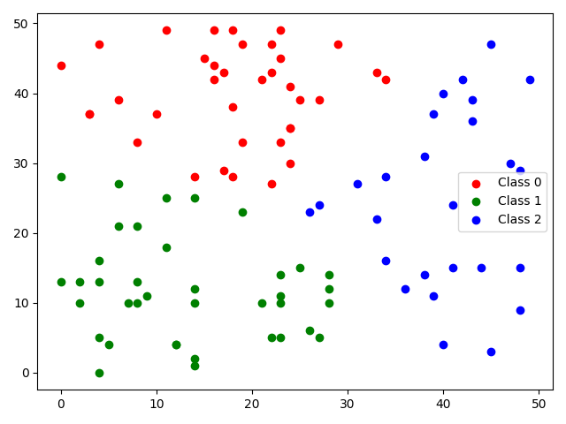

# Fast-Global-K-means-Clustering-Algorithm
This is the implementation of a paper, 'The global k-means clustering algorithm', published by A. Likas et al. [link](https://www.sciencedirect.com/science/article/pii/S0031320302000602)

## Prerequisities
- Language: Python
- Required Packages: numpy, sklearn, and matplotlib (only for visualization. Otherwise not required)

1) Python 2
```
pip install numpy sklearn matplotlib
```

2) Python 3
```
pip3 install numpy sklearn matplotlib
```

## Running the code
- How to make an object for Fast Global K-means Clustering.
```
from global_k_means_clustering import GKClustering
GKMC = GKClustering(n_cluster = num_cluster_you_define)
```
- How to run the fast global k-means clustering
```
km = GKMC.GlobalKMClustering(input_data)

print(km.cluster_centers_)
print(km.labels_)
```
- Example
```
data = np.random.randint(low = 0, high = 50, size = 200).reshape(100, 2)

GKMC = GKMClustering(n_cluster = 3)
km = GKMC.GlobalKMClustering(data)

print(km.cluster_centers_)
print(km.labels_)

plt.scatter(data[km.labels_ == 0, 0], data[km.labels_ == 0, 1], color = 'r')
plt.scatter(data[km.labels_ == 1, 0], data[km.labels_ == 1, 1], color = 'g')
plt.scatter(data[km.labels_ == 2, 0], data[km.labels_ == 2, 1], color = 'b')
plt.tight_layout()
plt.show()
```
The resultant figure would look as below.<br/>



